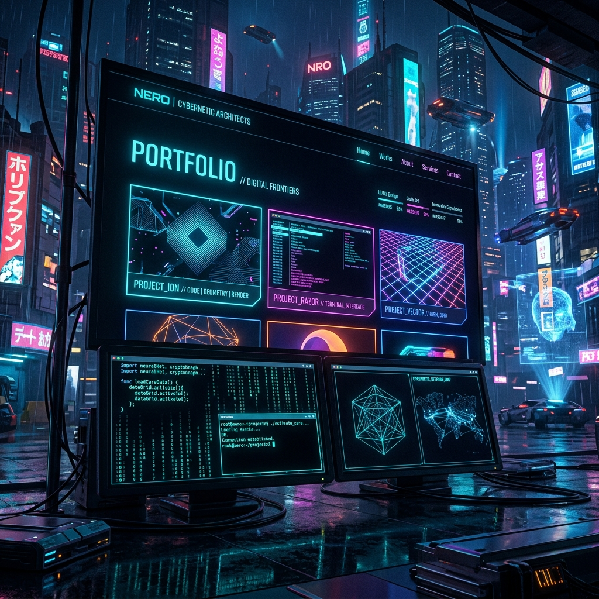

# 3D Portfolio Website - Pratik Yogesh Nerpagar

This repository contains the source code for a personal 3D portfolio built with React, TypeScript, Three.js, React Three Fiber, and GSAP. It includes animated page sections, a character scene, custom cursor interactions, and smooth transitions designed for a modern portfolio experience.

Hi! I'm **Pratik Yogesh Nerpagar**, a Full Stack Web Developer and Computer Engineering student at Vidya Pratishthan's College of Engineering (expected 2029). I specialize in designing and deploying user-centric web solutions.

### Connect with me:
- **GitHub**: [Paradoxai77](https://github.com/Paradoxai77)
- **LinkedIn**: [Pratik Nerpagar](https://www.linkedin.com/in/pratik-nerpagar-1b6156397)
- **YouTube**: [@Paradoxai77](https://www.youtube.com/@Paradoxai77)
- **Instagram**: [@pratik_nerpagar_77](https://www.instagram.com/pratik_nerpagar_77/)



## Table of Contents

- [Features](#features)
- [Tech Stack](#tech-stack)
- [Project Structure](#project-structure)
- [Getting Started](#getting-started)
- [Available Scripts](#available-scripts)
- [License](#license)

## Features

- Responsive one-page portfolio layout with reusable section components.
- 3D character scene rendering powered by React Three Fiber and Three.js.
- GSAP-powered animations and transitions for interactive storytelling.
- Custom cursor, hover interactions, and scroll-driven visual effects.
- Organized component architecture with dedicated utilities and style modules.

## Tech Stack

### Core

- React 18
- TypeScript
- Vite

### Animation and 3D

- GSAP
- Three.js
- `@react-three/fiber`
- `@react-three/drei`
- `@react-three/postprocessing`
- `@react-three/rapier`

### Supporting Libraries

- `react-icons`
- `react-fast-marquee`

## Project Structure

```text
.
├── public/                    # Static assets
├── src/
│   ├── assets/                # Local media/assets
│   ├── components/
│   │   ├── Character/         # 3D scene + character logic/utilities
│   │   ├── styles/            # Section/component CSS files
│   │   ├── About.tsx
│   │   ├── Career.tsx
│   │   ├── Contact.tsx
│   │   ├── Landing.tsx
│   │   ├── MainContainer.tsx  # Main page composition
│   │   ├── Navbar.tsx
│   │   ├── TechStack.tsx
│   │   ├── WhatIDo.tsx
│   │   └── Work.tsx
│   ├── context/               # Global providers (loading state, etc.)
│   ├── data/                  # Static data/content definitions
│   ├── App.tsx
│   └── main.tsx
├── package.json
└── vite.config.ts
```

## Getting Started

### Prerequisites

- Node.js 18+ (recommended)
- npm 9+ (or compatible)

### Installation

1. Clone the repository:

   ```bash
   git clone https://github.com/Paradoxai77/3dPortfolio.git
   cd 3dPortfolio
   ```

2. Install dependencies:

   ```bash
   npm install
   ```

3. Start the local development server:

   ```bash
   npm run dev
   ```

4. Open the URL shown in the terminal (typically `http://localhost:5173`).

## Available Scripts

- `npm run dev`  
  Starts Vite dev server and exposes host for local network testing.

- `npm run build`  
  Type-checks and builds a production-ready bundle.

- `npm run preview`  
  Serves the production build locally for verification.

- `npm run lint`  
  Runs ESLint checks across the project.

## License

This project is open source and available under the [MIT License](LICENSE).
